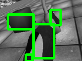
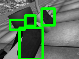

# Object Detection based on Color    

In this repository, an algorithm for Object Detection with OpenCV is introduced, which is based on use of color spaces.
This aims, primarily, to get coordinates, width and height of object using traditional OpenCV algorithms, so this repo doesn't contain what that objects are. 
The presented algorithmus supports:
 - Edge Detection
 - Corner Detection 
 - then Colorful Object Detection.

## Object Detection based on Color 
- Read a color image
- Convert the image to grayscale 

 

- Convert the image to binary (i.e. black and white only) using Otsu’s method or a fixed threshold that you choose.

 

- If the objects in the image are black, and the background is white, we need to invert the image so that white pixels become black and black pixels become white. Otherwise, we leave the image as-is.
- Detect the contours 

-  

## Dependencies

 * [numpy]
 * [cython]
 * [OpenCV]

## Setup

This implementation supports python 3.6+.

To use it, you should clone the repository and place it on your local directory.
Now, go into the folder

    "/ObjectDetectionBasedOnColor

There, perform the following commands on the terminal:

    python3.? setup.py build_ext --inplace